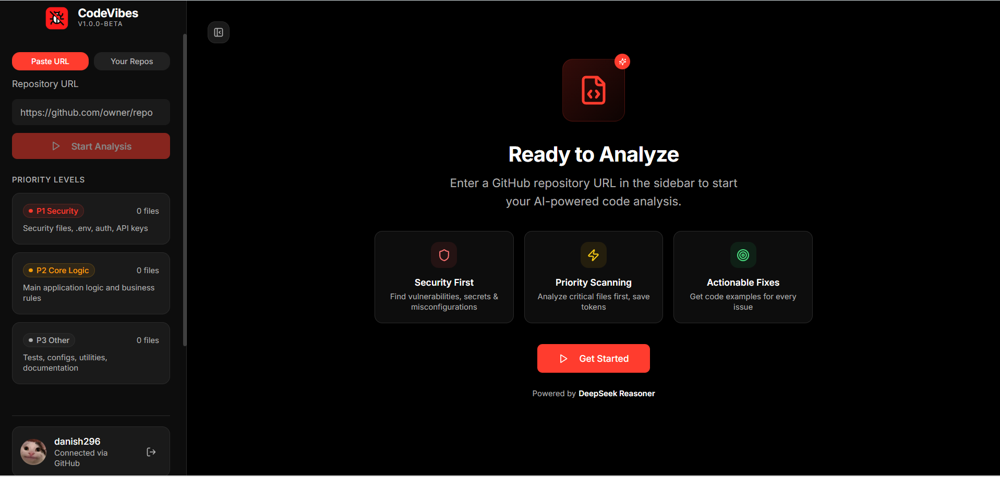
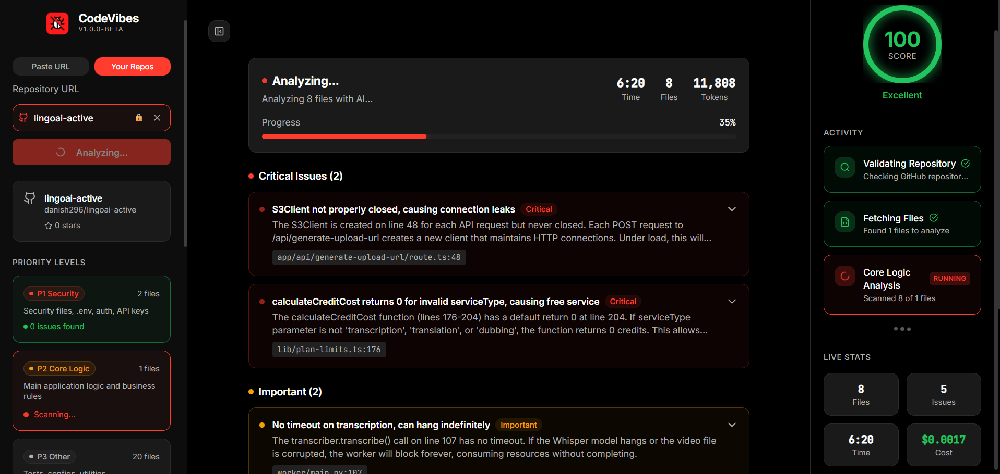
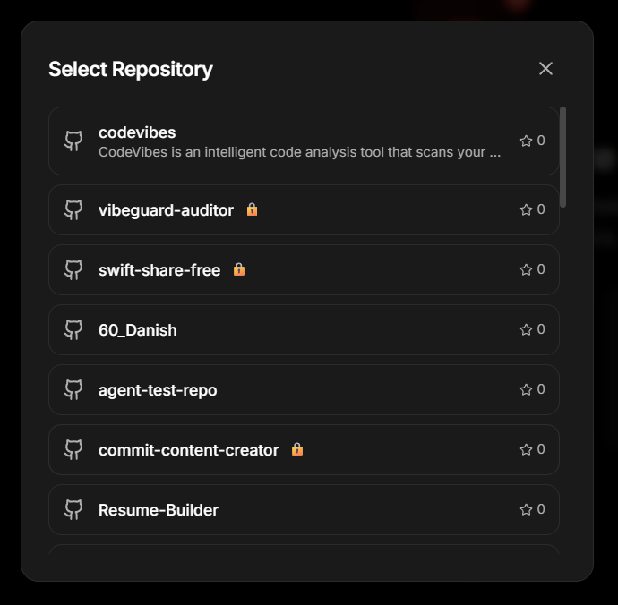
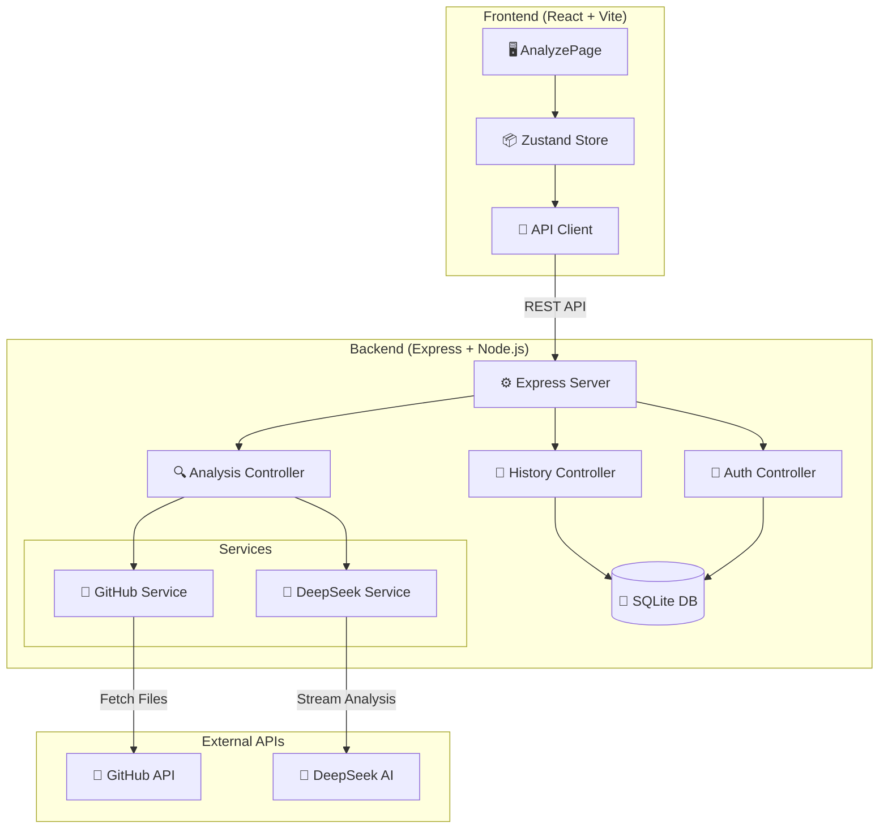
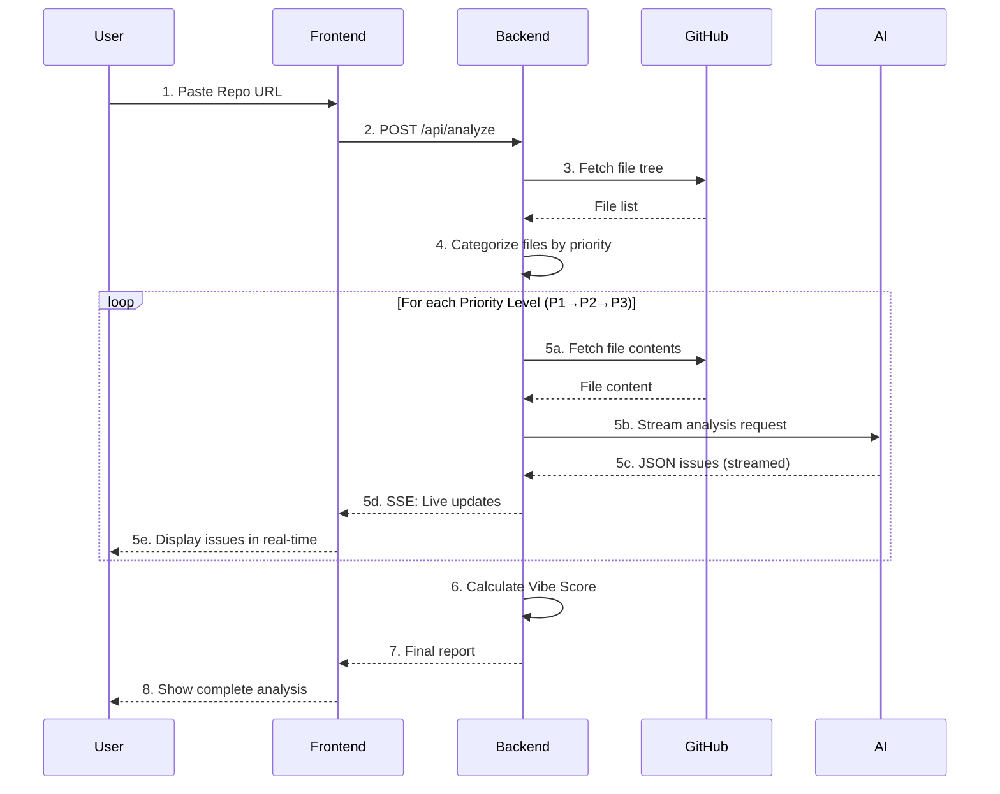
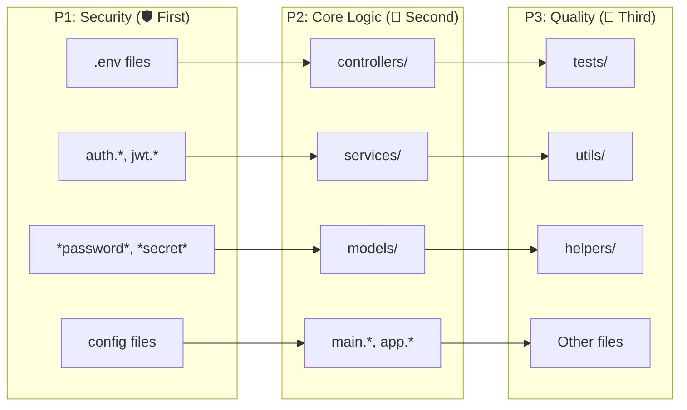

# CodeVibes 🌊

> **AI Code Review for Developers Who Can't Afford CodeRabbit.**

   

CodeVibes is an intelligent code analysis tool that scans your GitHub repositories using AI to identify **Security Vulnerabilities**, **Bugs & Performance Issues**, and **Code Quality** improvements—giving you a quantifiable **Vibe Score** and actionable insights.

---

## 📸 See it in Action

### Dashboard & Pre-Analysis
| Dashboard | Pre-Analysis View |
|-----------|-------------------|
|  |  |

### Analysis in Progress
| Execution | Repo Selection |
|-----------|----------------|
|  |  |

### Post-Analysis Results
| Post-Analysis | Detailed Stats |
|---------------|----------------|
|  |  |

### Report & Insights
| Report Insights |
|-----------------|
|  |

---

## 🏗️ System Architecture



---

## 🔄 Analysis Workflow

Here's how CodeVibes processes your repository:



---

## 🎯 Priority-Based Scanning

CodeVibes uses a **three-tier priority system** to analyze files in order of importance:



| Priority | Focus | Severity Levels | Example Detections |
|----------|-------|-----------------|-------------------|
+| **P1** | Security | CRITICAL, HIGH, MEDIUM, LOW | Hardcoded secrets, SQL injection, XSS, Auth bypass |
+| **P2** | Bugs & Performance | HIGH, MEDIUM, LOW | N+1 queries, Race conditions, Memory leaks |
+| **P3** | Code Quality | MEDIUM, LOW | DRY violations, Complexity, Maintainability |

---

## ✨ Key Features

### 🛡️ Security Analysis (P1)
- **Secret Detection**: AWS keys, GitHub tokens, Stripe keys, JWTs
- **Injection Attacks**: SQL, NoSQL, Command, Code injection
- **Auth Issues**: Missing JWT verification, IDOR, Session misconfig
- **XSS/CSRF**: Dangerous innerHTML, Missing CSRF tokens

### 🧠 Bug & Performance Detection (P2)
- **Logic Errors**: Null access, Off-by-one, Type coercion bugs
- **Performance**: N+1 queries, O(n²) algorithms, Memory leaks
- **Async Issues**: Unhandled promises, Race conditions
- **Data Integrity**: Missing transactions, Concurrent updates

### 💎 Code Quality Review (P3)
- **Readability**: Naming, Complexity analysis
- **DRY Violations**: Duplicated code patterns
- **Modern Practices**: Deprecated APIs, Better alternatives
- **Testability**: Hard-to-test code patterns

### 📊 Vibe Score
A calculated 0-100 score based on:
- Issue count and severity
- Files scanned vs issues found ratio
- Security issue weight (higher penalty)

---

## 🛠️ Tech Stack

| Layer | Technology | Purpose |
|-------|------------|---------|
| **Frontend** | React 18 + Vite | Fast, modern UI |
| | TailwindCSS | Utility-first styling |
| | Zustand | State management |
| | Lucide Icons | Consistent iconography |
| **Backend** | Node.js + Express | API server |
| | Better-SQLite3 | Local database |
| | tsx | TypeScript execution |
| **AI** | DeepSeek API | Code analysis |
| **Integration** | Octokit | GitHub API client |

---

## 🚀 Getting Started

### Prerequisites
- **Node.js** v18+
- **DeepSeek API Key** ([Get free key](https://platform.deepseek.com))
- **GitHub Token** (optional, for private repos)

### Quick Start

```bash
# 1. Clone the repository
git clone https://github.com/danish296/codevibes.git
cd codevibes

# 2. Install all dependencies
npm install
cd codevibes-backend && npm install && cd ..

# 3. Configure backend environment
cp codevibes-backend/.env.example codevibes-backend/.env
# Edit .env with your DeepSeek API key

# 4. Start both servers (use two terminals)
# Terminal 1: Backend
cd codevibes-backend && npm run dev

# Terminal 2: Frontend
npm run dev
```

### Environment Variables

Create `codevibes-backend/.env`:

```ini
# Required
PORT=3001
DEEPSEEK_API_KEY=sk-your-deepseek-key

# Optional
GITHUB_TOKEN=ghp-your-github-token
DB_PATH=./data/codevibes.db
DEEPSEEK_MODEL=deepseek-chat  # or deepseek-reasoner
ALLOWED_ORIGINS=http://localhost:8080
```

---

## 📂 Project Structure

```
codevibes/
├── src/                          # React Frontend
│   ├── components/
│   │   ├── layout/              # Header, Footer, Sidebar
│   │   └── ui/                  # UI primitives (Button, Card, etc.)
│   ├── pages/
│   │   ├── HomePage.tsx         # Landing page
│   │   ├── AnalyzePage.tsx      # Main analysis interface
│   │   └── SetupPage.tsx        # API key configuration
│   ├── lib/
│   │   └── api.ts               # Backend API client
│   └── store/
│       └── analysisStore.ts     # Zustand state
│
├── codevibes-backend/            # Express Backend
│   ├── src/
│   │   ├── controllers/
│   │   │   ├── analysisController.ts
│   │   │   ├── historyController.ts
│   │   │   └── githubController.ts
│   │   ├── services/
│   │   │   ├── deepseekService.ts  # AI prompts & streaming
│   │   │   └── githubService.ts    # Repo fetching
│   │   ├── utils/
│   │   │   ├── database.ts         # SQLite setup
│   │   │   └── logger.ts           # Winston logging
│   │   └── server.ts               # Express app
│   └── data/                       # SQLite database storage
│
├── public/screenshots/             # App screenshots
└── README.md                       # You are here!
```

---

## 🔌 API Reference

### Analysis Endpoints

| Endpoint | Method | Description |
|----------|--------|-------------|
| `/api/analyze` | POST | Start new analysis |
| `/api/analyze/stream` | GET | SSE stream for live updates |

### History Endpoints

| Endpoint | Method | Description |
|----------|--------|-------------|
| `/api/history` | GET | List past analyses |
| `/api/history` | POST | Save analysis result |
| `/api/history/:id` | DELETE | Delete analysis |

### GitHub Endpoints

| Endpoint | Method | Description |
|----------|--------|-------------|
| `/api/github/repos` | GET | List user's repos |
| `/api/github/validate` | POST | Check repo access |

---

## 🎨 Vibe Score Calculation

```typescript
function calculateVibeScore(issues: Issue[]): number {
  const weights = {
    CRITICAL: 25,
    HIGH: 15,
    MEDIUM: 5,
    LOW: 1
  };
  
  let penalty = issues.reduce((sum, issue) => 
    sum + weights[issue.severity], 0);
  
  return Math.max(0, 100 - penalty);
}
```

| Score Range | Label | Color |
|-------------|-------|-------|
| 90-100 | Excellent | 🟢 Green |
| 70-89 | Good | 🟡 Yellow |
| 50-69 | Needs Work | 🟠 Orange |
| 0-49 | Critical | 🔴 Red |

---

## 📝 Changelog

### [v1.0.0] - 2026-01-07

#### ⚡ Performance Optimizations
- **Parallel file fetching**: 5 concurrent requests instead of sequential (3-5x faster)
- **GitHub Tree API caching**: Reduced API calls by 80%
- **Lazy categorization**: Defer P2/P3 processing until needed (60% faster initial scan)

#### 🐛 Bug Fixes
- **Fixed history not saving**: Corrected SQL parameter mismatch (duplicate `cost` parameter)
- **Fixed timer issues**: 
  - Timer now restarts when continuing to next priority level
  - Timer now stops on analysis errors
  - Timer displays correctly when loading from history
- **Fixed DeepSeek response truncation**: Increased max_tokens from 8000 to prevent incomplete JSON responses

#### 🔧 Improvements
- **Enhanced error handling**: Better DeepSeek JSON parsing with truncation detection
- **Improved logging**: More detailed logs for debugging
- **Better OAuth setup**: Comprehensive setup guide with troubleshooting

#### 📚 Documentation
- Added comprehensive `.env.example` with all configuration options
- Improved error messages and user feedback
- Better TypeScript types and interfaces

### [v1.0.1] - 2026-01-10
📄 **New Changelog Page:** /changelog with full history.

🛡️ **Trust Indicators**: AES-256, Privacy, Open Source badges in Hero.

❓ **FAQ Section:** Added to Homepage.

🧭 **Navigation Updates**:
    - Header: API → CHANGELOG
    - Footer: Changelog (Resources), API Reference (Product), Jan 10 update badge.

### [v1.0.2] - 2026-01-12
🔒 **Security Hardening**: Expanded secret detection (AWS, Stripe, Google, etc.) & Critical severity for live keys.
⚡ **Stability**: Automated async error & memory leak detection.
📄 **Documentation**: Changelog updates & API ref alignments.
⬆️ **UX**: Added auto-scroll to top on navigation.

---

## 🤝 Contributing

Contributions are welcome! Please feel free to submit a Pull Request.

1. Fork the repository
2. Create your feature branch (`git checkout -b feature/amazing-feature`)
3. Commit your changes (`git commit -m 'Add amazing feature'`)
4. Push to the branch (`git push origin feature/amazing-feature`)
5. Open a Pull Request

---

## 📄 License

This project is licensed under the MIT License - see the [LICENSE](LICENSE) file for details.

---

## 🙏 Acknowledgments

- [DeepSeek](https://deepseek.com) for powerful AI reasoning
- [Shadcn/ui](https://ui.shadcn.com) for beautiful UI components
- [Lucide](https://lucide.dev) for crisp icons

---

## 📞 Support

- **Issues**: [GitHub Issues](https://github.com/danish296/codevibes/issues)
- **Discussions**: [GitHub Discussions](https://github.com/danish296/codevibes/discussions)

---

**Crafted with 💜 by Danish Akhtar**

Star ⭐ this repo if you find it helpful!
